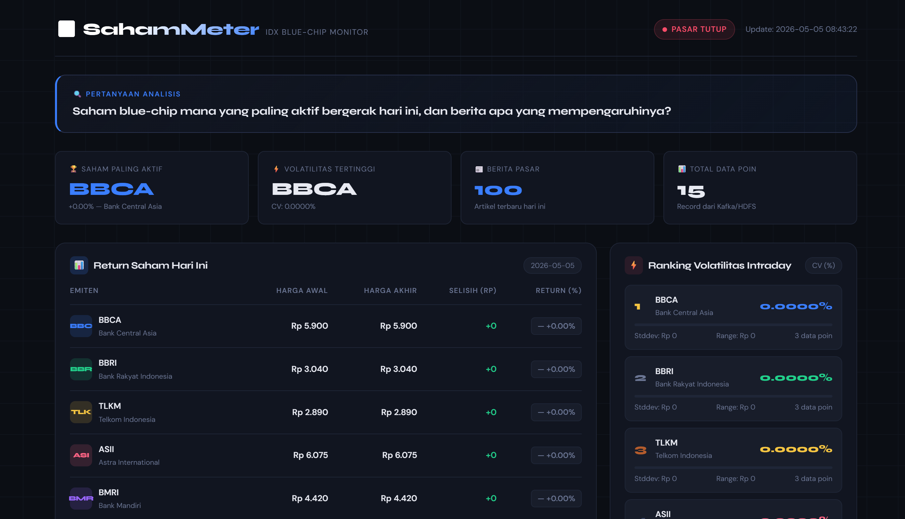

# SahamMeter — IDX Blue-Chip Monitor
### Big Data Pipeline End-to-End

---

## Mata Kuliah Big Data & Data Lakehouse 2026

---

## Anggota Kelompok & Kontribusi

| No | Nama | NRP | Kontribusi |
|----|------|-----|------------|
| 1 | Putu Yudi Nandanjaya Wiraguna | 5027241080 | Arsitektur infrastruktur Docker: `docker-compose-kafka.yml`, `docker-compose-hadoop.yml`, setup Hadoop (Namenode + Datanode) dan Kafka (Zookeeper + Broker) |
| 2 | M. Alfaeran Auriga Ruswandi | 5027241115 | Kafka Producer API Saham: `kafka/producer_api.py` — pengambilan data harga saham real-time dari Yahoo Finance dan pengiriman ke Kafka topic `saham-api` |
| 3 | Fika Arka Nuriyah | 5027241071 | Kafka Producer RSS & Consumer HDFS: `kafka/producer_rss.py`, `kafka/consumer_to_hdfs.py` — pengambilan berita pasar modal dari RSS dan penyimpanan data dari Kafka ke HDFS |
| 4 | Christiano Ronaldo Silalahi | 5027241025 | Spark Analysis: `spark/analysis.ipynb`, `spark/local_analysis.py` — analisis data saham (return, volatilitas, frekuensi penyebutan) menggunakan PySpark dan pembuatan `spark_results.json` |
| 5 | S. Farhan Baig | 5027241097 | Dashboard Serving Layer: `dashboard/app.py`, `dashboard/templates/index.html` — web dashboard Flask untuk visualisasi real-time hasil analisis |

---

## Topik yang Dipilih

**SahamMeter** — Sistem monitoring saham IDX blue-chip yang menggabungkan **data harga saham real-time** dengan **berita pasar modal** untuk memberikan insight kontekstual terhadap pergerakan saham.

### Justifikasi: Mengapa Topik Ini Menarik?

1. **Integrasi Data Real-Time & Berita**  
   Menggabungkan dua sumber data berbeda:
   - API saham (Yahoo Finance) — data kuantitatif
   - RSS berita pasar modal — data kualitatif  
   
   Memberikan **analisis kontekstual**, bukan hanya angka.

2. **Insight Lebih Mendalam**  
   Sistem dapat menjawab pertanyaan penting:
   > *"Saham blue-chip mana yang paling aktif bergerak hari ini, dan berita apa yang mempengaruhinya?"*

3. **Relevansi Dunia Nyata**  
   Digunakan oleh wealth management, analis saham, dan investor untuk monitoring pasar harian dan pengambilan keputusan investasi.

4. **Implementasi Big Data Pipeline Lengkap**  
   Menggunakan arsitektur modern end-to-end:
   - **Kafka** — ingestion/streaming data
   - **HDFS** — distributed storage
   - **Spark** — batch analysis
   - **Dashboard** — visualisasi real-time

---

## Diagram Arsitektur


**Alur Data:**
```
Yahoo Finance ──┐                    ┌── HDFS ── Spark ──┐
                ├── Kafka Topics ────┤                    ├── spark_results.json ── Dashboard
RSS Feeds ──────┘                    └── Local JSON ─────┘
                                        (fallback)
```

---

## Cara Menjalankan Sistem (Step-by-Step)

### Prasyarat
- **Docker Desktop** terinstall dan berjalan
- **Python 3.9+** terinstall
- **pip** package manager

### Step 1: Clone Repository

```bash
git clone https://github.com/yudi0312/kelompok-1-ets-bigdata.git
cd kelompok-1-ets-bigdata/bigdata-project
```

### Step 2: Install Python Dependencies

```bash
pip install flask pandas yfinance feedparser kafka-python hdfs
```

### Step 3: Jalankan Docker — Kafka & Zookeeper

```bash
docker-compose -f docker-compose-kafka.yml up -d
```

Tunggu hingga Kafka broker siap (sekitar 15-30 detik).

### Step 4: Jalankan Docker — Hadoop (HDFS + Spark)

```bash
docker-compose -f docker-compose-hadoop.yml up -d
```

Verifikasi: buka **HDFS Web UI** di `http://localhost:9870`

### Step 5: Jalankan Kafka Producer — Data Saham

```bash
python kafka/producer_api.py
```

Producer akan mengambil harga saham (BBCA, BBRI, TLKM, ASII, BMRI) dari Yahoo Finance setiap 60 detik dan mengirimkannya ke Kafka topic `saham-api`.

> **Catatan:** Jika Kafka tidak tersedia, producer akan otomatis berjalan di mode **LOCAL-ONLY** dan menyimpan data ke `dashboard/data/live_api.json`.

### Step 6: Jalankan Kafka Producer — Berita RSS

```bash
python kafka/producer_rss.py
```

Producer akan mengambil berita pasar modal dari RSS feed (Bisnis.com, CNN Indonesia) setiap 5 menit dan mengirimkannya ke Kafka topic `saham-rss`.

### Step 7: Jalankan Kafka Consumer --> HDFS

```bash
python kafka/consumer_to_hdfs.py
```

Consumer akan membaca data dari kedua Kafka topic dan menyimpannya ke HDFS:
- `/data/saham/api/` — data harga saham
- `/data/saham/rss/` — data berita

### Step 8: Jalankan Spark Analysis

**Opsi A — via Jupyter Notebook (di Docker):**
1. Buka Jupyter di `http://localhost:8888`
2. Navigasi ke folder `work/`
3. Jalankan `analysis.ipynb`

**Opsi B — via Script Lokal (tanpa Docker):**
```bash
python spark/local_analysis.py
```

Script ini akan membaca data dari HDFS (atau fallback ke file lokal), menghitung analisis return, volatilitas, dan frekuensi penyebutan, lalu menyimpan hasilnya ke `dashboard/data/spark_results.json`.

### Step 9: Jalankan Dashboard

```bash
python dashboard/app.py
```

### Step 10: Buka Dashboard di Browser

```
http://localhost:5000
```

Dashboard akan menampilkan:
- Tabel return saham hari ini
- Ranking volatilitas intraday
- Chart return vs volatilitas
- Frekuensi penyebutan di berita
- Berita terbaru pasar modal

Dashboard melakukan **auto-refresh** setiap 60 detik.

---

## Screenshot

### 1. HDFS Web UI (`http://localhost:9870`)

> Screenshot HDFS Namenode Web UI menampilkan status cluster Hadoop, kapasitas storage, dan file yang tersimpan di `/data/saham/`.



### 2. Kafka Consumer Output

> Screenshot terminal menunjukkan consumer berhasil membaca pesan dari Kafka topic `saham-api` dan `saham-rss`, lalu menyimpannya ke HDFS.

*(Tambahkan screenshot Kafka consumer output di sini)*

### 3. Dashboard Berjalan


Dashboard menampilkan data real-time:
- Harga saham terkini (BBCA, BBRI, TLKM, ASII, BMRI)
- Return dan volatilitas intraday
- 100 berita pasar modal terbaru
- Frekuensi penyebutan saham di berita

---

## Tantangan Terbesar & Cara Mengatasinya

### 1. Git Merge Conflict pada File Dashboard

**Masalah:** File `dashboard/app.py` dan `dashboard/templates/index.html` mengalami merge conflict besar setelah beberapa anggota mengedit file yang sama secara bersamaan. Kedua file menjadi duplikat (konten tertulis dua kali dengan conflict markers `<<<<<<< HEAD` dan `=======`).

**Solusi:** Melakukan manual conflict resolution — mengidentifikasi blok kode yang benar, menghapus duplikasi, dan memastikan tidak ada conflict marker tersisa di seluruh project.

---

### 2. Docker Image Gagal Pull (Storage Driver Error)

**Masalah:** Image `jupyter/pyspark-notebook:spark-3.3.0` gagal di-pull karena error Docker Desktop:
```
failed to Lchown: read-only file system
```

**Solusi:** 
- Restart Docker Desktop untuk mereset storage driver
- Menggunakan `local_analysis.py` sebagai fallback agar analisis tetap bisa berjalan tanpa Spark container

---

### 3. Pipeline Putus Ketika Docker Mati

**Masalah:** Pipeline `Producer --> Kafka --> HDFS --> Spark` bergantung sepenuhnya pada Docker. Ketika Docker mati atau container crash, seluruh data flow berhenti dan dashboard tidak bisa menampilkan data terbaru.

**Solusi:** Mengimplementasikan arsitektur **dual-write** pada producer:
- Data tetap dikirim ke Kafka (jika tersedia)
- Data juga disimpan ke file lokal (`live_api.json`, `live_rss.json`) sebagai backup
- `local_analysis.py` bisa membaca dari HDFS (utama) atau file lokal (fallback)
- Dashboard tetap berfungsi meskipun Docker mati

---

### 4. Data Saham 0% Return (Pasar Tutup)

**Masalah:** Saat pengujian, semua return dan volatilitas menunjukkan 0% karena pasar saham Indonesia tutup (weekend/hari libur). Harga yang diambil dari Yahoo Finance selalu sama.

**Solusi:** 
- Memahami bahwa ini adalah perilaku normal — saat pasar tutup, harga memang tidak berubah
- `local_analysis.py` tetap menghitung analytics dengan benar, hanya hasilnya 0% karena data statis
- Ketika pasar buka (Senin-Jumat, 09:00-16:00 WIB), analytics akan otomatis menampilkan variasi harga

---

### 5. RSS Feed Tidak Konsisten

**Masalah:** Beberapa RSS feed (Bisnis.com) terkadang mengembalikan 0 artikel, sementara feed lainnya (CNN Indonesia) mengembalikan data lengkap.

**Solusi:** 
- Menggunakan multiple RSS sources sebagai redundansi
- Producer RSS dilengkapi error handling per-feed sehingga jika satu feed gagal, feed lainnya tetap diproses
- Deduplikasi artikel berdasarkan hash URL untuk menghindari berita duplikat

---

## Struktur Project

```
bigdata-project/
├── README.md
├── docker-compose-kafka.yml      # Docker: Kafka + Zookeeper
├── docker-compose-hadoop.yml     # Docker: HDFS + Spark Jupyter
├── hadoop.env                    # Environment variables Hadoop
│
├── kafka/                        # Data Ingestion Layer
│   ├── producer_api.py           # Producer: Yahoo Finance --> Kafka
│   ├── producer_rss.py           # Producer: RSS Feed --> Kafka
│   └── consumer_to_hdfs.py       # Consumer: Kafka --> HDFS
│
├── spark/                        # Processing Layer
│   ├── analysis.ipynb            # Spark analysis (Jupyter Notebook)
│   └── local_analysis.py         # Analisis lokal (fallback tanpa Docker)
│
└── dashboard/                    # Serving Layer
    ├── app.py                    # Flask web server
    ├── templates/
    │   └── index.html            # Dashboard UI
    ├── static/                   # CSS, JS, assets
    └── data/
        ├── spark_results.json    # Output analisis Spark/lokal
        ├── live_api.json         # Cache data harga saham
        └── live_rss.json         # Cache berita RSS
```

---

## Teknologi yang Digunakan

| Teknologi | Versi | Fungsi |
|-----------|-------|--------|
| Apache Kafka | 3.x | Message broker / streaming |
| Apache Hadoop HDFS | 3.2.1 | Distributed storage |
| Apache Spark | 3.3.0 | Data processing & analytics |
| Python | 3.9+ | Scripting & backend |
| Flask | 3.x | Web framework dashboard |
| yfinance | - | API data saham Yahoo Finance |
| feedparser | 6.x | Parser RSS feed berita |
| Chart.js | 4.4.1 | Visualisasi chart di dashboard |
| Docker | - | Containerization |

---

> **Kelompok 1 — Big Data ETS 2026**  
> Mata Kuliah Big Data & Data Lakehouse
